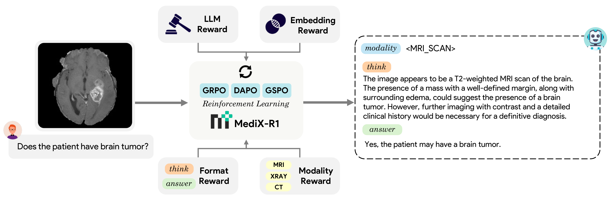
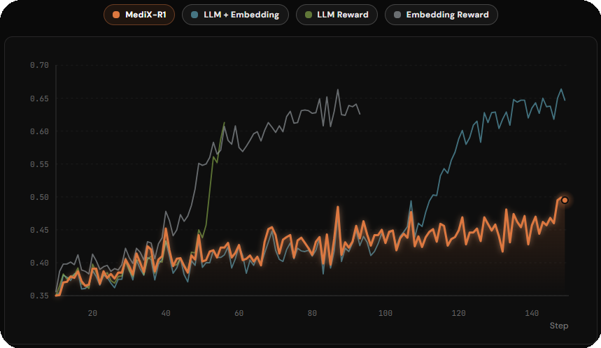
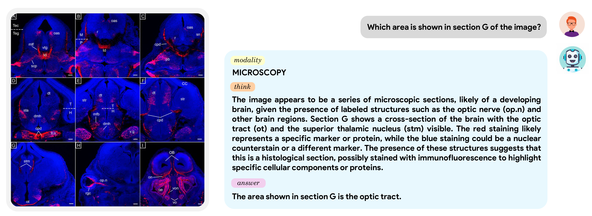
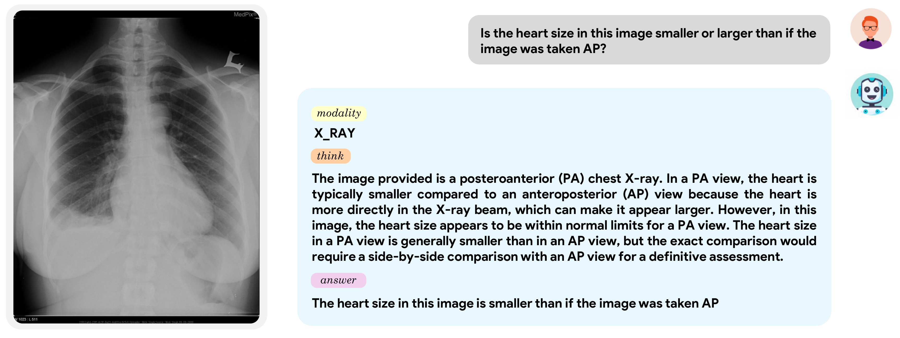

# MediX-R1: Open-Ended Medical Reinforcement Learning

<p align="center">
    
</p>

<p align="center">
    
</p>

#### [Sahal Shaji Mullappilly](https://scholar.google.com/citations?user=LJWxVpUAAAAJ&hl=en)\*, [Mohammed Irfan K](https://scholar.google.com/citations?user=GJp0keYAAAAJ&hl=en)\*, [Omair Mohamed](https://scholar.google.com), [Mohamed Zidan](https://scholar.google.com), [Fahad Khan](https://sites.google.com/view/fahadkhans/home), [Salman Khan](https://salman-h-khan.github.io/), [Rao Muhammad Anwer](https://scholar.google.com/citations?hl=en&authuser=1&user=_KlvMVoAAAAJ), and [Hisham Cholakkal](https://scholar.google.com/citations?hl=en&user=bZ3YBRcAAAAJ)

\**Equally contributing first authors*

#### **Mohamed Bin Zayed University of Artificial Intelligence (MBZUAI), UAE**

[](https://medix.cvmbzuai.com)
[](https://arxiv.org/pdf/2602.23363)
[](https://huggingface.co/collections/MBZUAI/medix-r1)
[](https://medix.cvmbzuai.com/leaderboard)

---

## Overview

MediX-R1 is an open-ended Reinforcement Learning (RL) framework for medical multimodal large language models (MLLMs) that enables clinically grounded, free-form answers beyond multiple-choice formats. MediX-R1 fine-tunes vision-language backbones with Group-Based RL and a composite reward tailored for medical reasoning: an LLM-based accuracy reward, a medical embedding-based semantic reward, and lightweight format and modality rewards that enforce interpretable reasoning.

Despite using only ~50K instruction examples, MediX-R1 achieves excellent results across standard medical LLM and VLM benchmarks, outperforming strong open-source baselines.

**Highlights:**
- Our **8B** model achieves an overall average of **68.8%**, outperforming the much larger 27B MedGemma (68.4%).
- Our **30B** model achieves the best overall score of **73.6%**, demonstrating the effectiveness of our composite reward design.

---

## Contributions

- We introduce an **open-ended RL framework** for medical MLLMs that produces clinically grounded, free-form answers beyond MCQ formats.
- We design a **composite reward** combining LLM-based accuracy, embedding-based semantic similarity, format adherence, and modality recognition, providing stable and informative feedback where traditional verifiable or MCQ-only rewards fall short.
- We propose a **unified evaluation framework** for both text-only and image+text tasks using a Reference-based LLM-as-judge, capturing semantic correctness, reasoning, and contextual alignment.
- Despite using only **~50K** instruction examples, MediX-R1 achieves state-of-the-art results across diverse medical LLM and VLM benchmarks, with particularly large gains on open-ended clinical tasks.

---

## Architecture

<p align="center">
  
</p>

---

## Composite Reward Design

MediX-R1 uses a multi-signal reward combining LLM-based accuracy, embedding-based semantic similarity, format adherence, and modality recognition. This stabilizes training and prevents reward hacking compared to single-signal approaches.

<p align="center">
  
</p>

---

## Qualitative Examples

<p align="center">
  
  
</p>

---

## Training

We provide training configs for all model sizes using GRPO and DAPO algorithms. The training pipeline uses a vLLM-based reward server for LLM-as-judge scoring during RL training.

```bash
cd training
pip install -e .
bash vllm_serve.sh       # Step 1: Start the reward server
bash run_train.sh        # Step 2: Launch RL training
bash merge_model.sh      # Step 3: Merge FSDP checkpoints
```

Training data: [MBZUAI/medix-rl-data](https://huggingface.co/datasets/MBZUAI/medix-rl-data) (~51K train, ~2.5K test samples)

See [`training/README.md`](training/README.md) for detailed setup, configuration options, and per-model scripts.

## Evaluation

We propose a unified evaluation framework for both text-only (LLM) and image+text (VLM) tasks using a Reference-based LLM-as-judge across 17 medical benchmarks.

```bash
cd eval
pip install uv && uv pip install -r requirements.txt
bash eval.sh             # Run all phases: generate, evaluate, score
```

Supports self-hosted judge models via vLLM or [OpenRouter](https://openrouter.ai/) as a remote alternative. Results can be submitted to the [MediX Leaderboard](https://medix.cvmbzuai.com/leaderboard).

See [`eval/README.md`](eval/README.md) for task selection, CLI reference, and MMMU-Medical evaluation.

---

## Model Zoo

| Model | HuggingFace |
|-------|-------------|
| MediX-R1-2B | [MBZUAI/MediX-R1-2B](https://huggingface.co/MBZUAI/MediX-R1-2B) |
| MediX-R1-8B | [MBZUAI/MediX-R1-8B](https://huggingface.co/MBZUAI/MediX-R1-8B) |
| MediX-R1-30B | [MBZUAI/MediX-R1-30B](https://huggingface.co/MBZUAI/MediX-R1-30B) |

---

## Citation

If you use MediX-R1 in your research, please cite our work as follows:

```bibtex
@misc{mullappilly2026medixr1openendedmedical,
      title={MediX-R1: Open Ended Medical Reinforcement Learning}, 
      author={Sahal Shaji Mullappilly and Mohammed Irfan Kurpath and Omair Mohamed and Mohamed Zidan and Fahad Khan and Salman Khan and Rao Anwer and Hisham Cholakkal},
      year={2026},
      eprint={2602.23363},
      archivePrefix={arXiv},
      primaryClass={cs.CV},
      url={https://arxiv.org/abs/2602.23363}, 
}
```

---

## License

This project is released for **research purposes only** under [*CC-BY-NC-SA 4.0*](https://creativecommons.org/licenses/by-nc-sa/4.0/legalcode.en) License. It is not intended for clinical or commercial use.

Users are urged to employ MediX-R1 responsibly, especially when applying its outputs in real-world medical scenarios. It is imperative to verify the model's advice with qualified healthcare professionals and not rely on it for medical diagnoses or treatment decisions.

---

## Acknowledgements

We are thankful to [EasyR1](https://github.com/hiyouga/EasyR1) (a fork of [veRL](https://github.com/volcengine/verl)) for their open-source RL training framework.

This work was partially supported with  *NVIDIA Academic Grant 2025* and *MBZUAI-IITD* Research Collaboration Seed Grant. 

We are grateful to [MBZUAI](https://mbzuai.ac.ae/) for compute and support.
